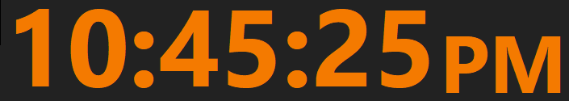

# Clock — Reloj Digital Minimalista para Windows

[](https://go.dev)
[](LICENSE)
[](https://www.microsoft.com/windows)

> Un reloj digital minimalista, sin bordes, personalizable y eficiente.
> Implementado en **Go puro** con **API Win32 nativa** — sin CGO, sin dependencias externas.

<p align="center">
  
</p>

## ✨ Características

- **Reloj Digital** — Muestra la hora en formato 24h (`15:04:05`) o 12h (`03:04:05 PM`)
- **Minimalista** — Ventana sin bordes, sin barra de título, puede quedar detrás de otras ventanas
- **Arrastrable** — Haz clic y arrastra desde cualquier parte del reloj
- **Redimensionable** — Barra inferior completa para cambiar el tamaño
- **Fuente Adaptativa** — El texto se escala automáticamente al 100% de la altura de la ventana
- **Menú Hover** — Botones flotantes con texto al pasar el ratón por el borde superior:
  - `Cerrar` Cierra la aplicación
  - `Reset` Restaura valores por defecto
  - `Color` Selector de colores (texto)
  - `24h`/`12h` Alternar formato de hora
- **Persistencia** — Guarda posición, tamaño y colores automáticamente al cerrar
- **Cierre rápido** — Tecla `Escape`
- **Eficiente** — ~2.2MB, 0% CPU en reposo, sin dependencias externas

## 🚀 Instalación

### Descarga directa

Descarga el binario desde [Releases](https://github.com/Angelbar/Clock/releases/latest) y colócalo en tu `PATH`:

```bash
# Ejemplo: colocarlo en scripts/
cp Clock.exe ~/scripts/
```

### Compilar desde fuente

```bash
# Requisitos: Go 1.26+
git clone https://github.com/Angelbar/Clock.git
cd Clock
go build -ldflags="-H=windowsgui -s -w" -o Clock.exe
```

## 🎯 Uso

```bash
Clock
# O desde otro directorio si está en el PATH
```

La ventana aparecerá centrada en la pantalla con los colores por defecto.

### Controles

| Acción | Cómo |
|--------|------|
| **Mover** | Arrastrar cualquier parte del reloj |
| **Redimensionar** | Arrastrar el borde inferior |
| **Menú hover** | Pasar el ratón por el borde superior |
| **Cambiar formato** | Botón `24h`/`12h` en el menú |
| **Cambiar colores** | Botón `Color` en el menú |
| **Reset** | Botón `Reset` en el menú |
| **Cerrar** | Escape o botón `Cerrar` |

## ⚙️ Configuración

Los ajustes se guardan en `%APPDATA%/Clock/config.json`:

```json
{
  "bg": "#222222",
  "fg": "#F31A1A",
  "w": 380,
  "h": 75,
  "x": 540,
  "y": 300,
  "ampm": false
}
```

| Campo | Descripción | Default |
|-------|-------------|---------|
| `bg` | Color de fondo (hexadecimal) | `#222222` |
| `fg` | Color del texto (hexadecimal) | `#F31A1A` |
| `w` | Ancho de la ventana | `380` |
| `h` | Alto de la ventana | `75` |
| `x` | Posición horizontal | centrado |
| `y` | Posición vertical | centrado |
| `ampm` | Formato 12h (true) / 24h (false) | `false` |

Para restaurar valores por defecto: botón `Reset` en el menú hover.

## 🏗️ Estructura del proyecto

```
Clock/
├── main.go           # Aplicación completa (Win32 API en Go puro)
├── go.mod            # Módulo Go
├── PRD.md            # Documento de requisitos
├── README.md         # Este archivo
├── LICENSE           # Licencia MIT
├── CONTRIBUTING.md   # Guía para contribuir
├── .github/
│   └── ISSUE_TEMPLATE/
│       ├── bug_report.md
│       └── feature_request.md
└── screenshot.png
```

## 🛠️ Desarrollo

### Requisitos

- [Go](https://go.dev/dl/) 1.26 o superior (Windows)
- Solo Windows 10/11 (usa API Win32 nativa)

### Compilar

```bash
# Build estándar (con consola para debug)
go build -o Clock.exe

# Build release (sin consola, optimizado)
go build -ldflags="-H=windowsgui -s -w" -o Clock.exe
```

### Debug

Para ver bordes rojos que muestran los límites de todos los elementos (texto, botones, zona hover, barra inferior):

```bash
Clock -debug
```

Para ver mensajes de error en caso de fallo, compila sin `-H=windowsgui` y ejecuta desde terminal.

## 📐 Arquitectura

El programa usa un único lazo de mensajes Win32 (`GetMessage`/`DispatchMessage`) con una ventana `WS_POPUP`:

```
main()
├── Registrar clase de ventana
├── Crear ventana (WS_POPUP + WS_EX_TOOLWINDOW)
├── Iniciar timer (100ms para actualización)
└── Lazo de mensajes

wndProc()
├── WM_PAINT    → drawClock() [doble buffer GDI: fondo, texto, botones]
├── WM_TIMER    → invalidar ventana (solo cuando cambia la hora)
├── WM_NCHITTEST → HTCAPTION (arrastre) / HTBOTTOM (resize)
├── WM_MOUSEMOVE → hover buttons logic
├── WM_LBUTTONDOWN → manejar clicks en botones
├── WM_KEYDOWN  → Escape → closeWin()
├── WM_CLOSE    → saveConfig() → DestroyWindow
└── WM_DESTROY  → PostQuitMessage
```

### Dependencias

**Cero dependencias externas.** Solo stdlib de Go + syscall para API Win32.

| Paquete | Propósito |
|---------|-----------|
| `syscall` | Llamadas a DLLs Win32 (user32, gdi32, comdlg32, uxtheme) |
| `encoding/json` | Configuración persistente |
| `time` | Formateo de hora |
| `os` / `path/filepath` | Rutas de archivos |

## 📦 Releases

Cada release incluye:
- `Clock.exe` — Binario para Windows (compilado con `-H=windowsgui`)
- `checksums.txt` — Sumas de verificación SHA-256

## 🤝 Contribuciones

Las contribuciones son bienvenidas. Por favor lee [CONTRIBUTING.md](CONTRIBUTING.md) para más detalles.

## 📄 Licencia

Distribuido bajo licencia MIT. Ver [LICENSE](LICENSE) para más información.

---

<p align="center">
  <sub>Hecho con ❤️ y Win32 API en Go</sub>
</p>
